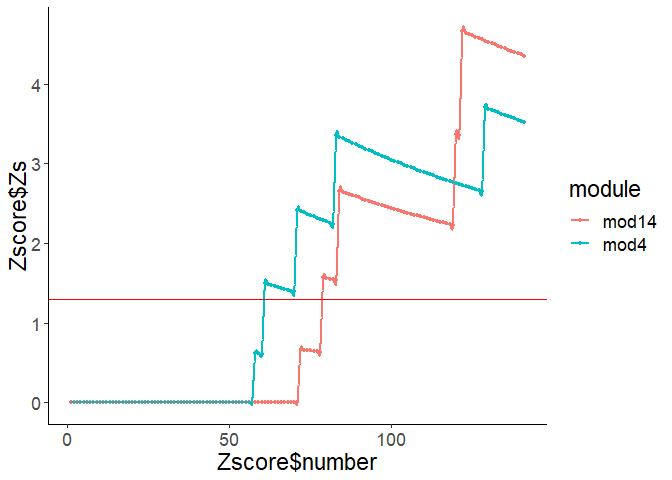
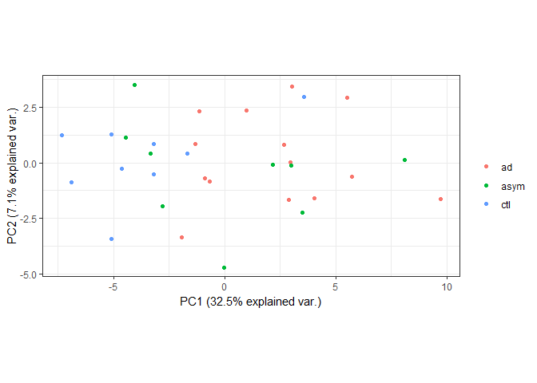
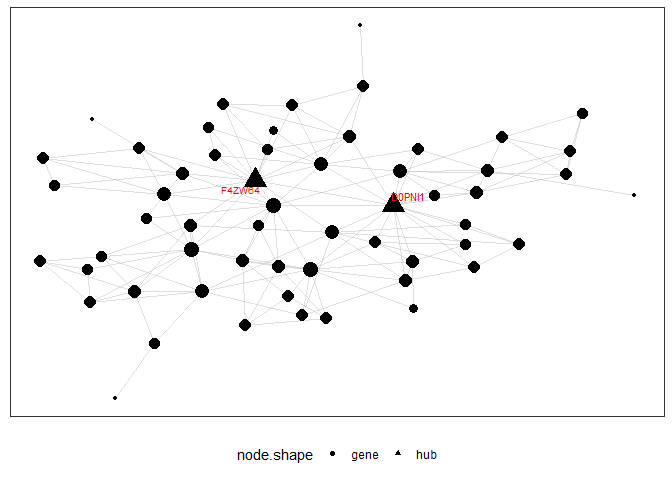

<!-- README.md is generated from README.Rmd. Please edit that file -->
DDPNA
=====

<!-- badges: start -->
<!-- badges: end -->
DDPNA is a package for Disease-Drived Differential Proteins(DFP) and Proteome-Wide Co-expression Network Associated Analysis. The goal of DDPNA is offered a better methods to analyze omic data. The package is designed for proteomic data, but it is also fit for expression data in RNA-seq and metabolome. It is associated DFP and co-expression network module, and constructed a Mod-DFP network to remove lower connectivity DFP. The lower connectivity DFP is hard to get the key function in PPI and is more likely a false postive protein. The Mod-DFP network can also get DFP related proteins which is more likely a false negative protein. It provides the essential statisic analysis included t.test, ANOVA analysis to extract differential proteins. The package also provide some module analysis included PCA analysis, two enrichment analysis, Planner maximally filtered graph extraction and hub analysis. The co-expression network should constructed by other package or software.(WGCNA package or others)

Installation
------------

You can install the developed version of DDPNA from [github](https://github.com/liukf10/DDPNA)

``` r
install.packages("devtools")
devtools::install_github("liukf10/DDPNA")
```

Example
-------

This is a basic example which shows you how to solve a common problem:

``` r
library(DDPNA)
#> 
##data extract and clean
data(Dforimpute)
#outlier sample remove and miss value impute
data <- Data_impute(Dforimpute, miss.value = 0, distmethod = "manhattan", plot = FALSE)
#> Warning in .NAnum.proteomic_data(data, miss.value = miss.value, verbose =
#> verbose): The sample ad059 have been removed
logD <- data$log2_value
rownames(logD) <- data$inf$ori.ID
## network construction
#net is constructed by WGCNA blockwiseModules function.
#the parameter:datExpr = t(logD), TOMType = "unsigned", deepSplit = 4, minModuleSize = 17, reassignThreshold = 0.05, mergeCutHeight = 0.07
data(net)
## module information extract
Module <- Module_inf(net, data$inf)
## differential protein analysis
oriData <- Dforimpute$LFQ
colnames(oriData) <- gsub("LFQ.intensity.","", colnames(oriData))
oriData <- oriData[,colnames(logD)]
rownames(oriData) <- Dforimpute$inf$ori.ID
group <- gsub("[0-9]+","", colnames(oriData))
up <- changedID(oriData, group, vs.set2 = "ad",vs.set1 = "ctl",
                rank = "foldchange",anova = FALSE, Padj = "none",cutoff = 1,
                datatype = "none",fctype = "up")
##module-DFP associated analysis
FCSenrich <- Module_Enrich(Module, up, datainf = rownames(oriData), coln="ori.ID")
FCSenrich <- FCSenrichplot(FCSenrich)
```



``` r
pos <- which(net$colors == 4)
Mod4_PCA <- modpcomp(logD[pos,], net$colors[pos], plot = TRUE, group = group)
```



``` r
Mod4 <- getmoduleHub(logD, Module, 4, coln = "ori.ID",adjustp = FALSE)
#> ####### PFN Calculation commences ########
#> permutation no.:1,2,3,4,5,6,7,8,9,10,11,12,13,14,15,16,17,18,19,20,21,22,23,24,25,26,27,28,29,30,31,32,33,34,35,36,37,38,39,40,41,42,43,44,45,46,47,48,49,50,51,52,53,54,55,56,57,58,59,60,61,62,63,64,65,66,67,68,69,70,71,72,73,74,75,76,77,78,79,80,81,82,83,84,85,86,87,88,89,90,91,92,93,94,95,96,97,98,99,100,
if (requireNamespace("MEGENA", quietly = TRUE)) {
  try(library(MEGENA), silent = TRUE)
  PMFG <- plot_subgraph(module = Mod4$degreeStat$gene,
                        hub = Mod4$hub, PFN = Mod4$PMFG,
                        node.default.color = "black",
                        gene.set = NULL, color.code = c("grey"),
                        show.legend = TRUE, label.hubs.only = TRUE,
                        hubLabel.col = "red", hubLabel.sizeProp = 0.5,
                        show.topn.hubs = 10, node.sizeProp = 13,
                        label.sizeProp = 13, label.scaleFactor = 10,
                        layout = "kamada.kawai")
  print(PMFG)
  }
#> Warning: package 'MEGENA' was built under R version 3.5.3
#> Loading required package: doParallel
#> Warning: package 'doParallel' was built under R version 3.5.3
#> Loading required package: foreach
#> Warning: package 'foreach' was built under R version 3.5.2
#> Loading required package: iterators
#> Warning: package 'iterators' was built under R version 3.5.2
#> Loading required package: parallel
#> Loading required package: igraph
#> Warning: package 'igraph' was built under R version 3.5.2
#> 
#> Attaching package: 'igraph'
#> The following objects are masked from 'package:stats':
#> 
#>     decompose, spectrum
#> The following object is masked from 'package:base':
#> 
#>     union
#>  - # of genes: 57 
#>  - # of hubs: 2 
#> - generating module subnetwork figure...
#> $pnet
```



    #> 
    #> $node.features
    #>              node.lab         id node.size node.shape          X1
    #> A8YXX5         A8YXX5     A8YXX5 20.718004       gene -0.18712467
    #> C9J6D1         C9J6D1     C9J6D1 14.472676       gene  1.53982219
    #> Q549N0         Q549N0     Q549N0 15.717805       gene -1.51355990
    #> F6U1T9         F6U1T9     F6U1T9 11.197591       gene -0.27010470
    #> Q9BRX8         Q9BRX8     Q9BRX8 17.747761       gene  0.04681198
    #> P63241         P63241     P63241 20.071471       gene -1.41979759
    #> F4ZW64         F4ZW64     F4ZW64 33.592772        hub -0.75209972
    #> Q5TE61         Q5TE61     Q5TE61 17.747761       gene  0.74573368
    #> A0A024R5K1 A0A024R5K1 A0A024R5K1 13.000000       gene  2.47463646
    #> A0A0A0MQW0 A0A0A0MQW0 A0A0A0MQW0 11.197591       gene  0.36651549
    #> J3QL05         J3QL05     J3QL05 15.717805       gene  0.21711202
    #> B4DJS7         B4DJS7     B4DJS7 11.197591       gene -2.98445253
    #> D0PNI1         D0PNI1     D0PNI1 35.019834        hub  0.67298444
    #> Q9UII2         Q9UII2     Q9UII2 20.718004       gene -0.56872342
    #> Q5T6H7         Q5T6H7     Q5T6H7  8.873881       gene -0.72650792
    #> Q9H1E3         Q9H1E3     Q9H1E3  8.873881       gene -0.63453631
    #> Q9UPR5         Q9UPR5     Q9UPR5 14.472676       gene  0.80125535
    #> Q2M2I8         Q2M2I8     Q2M2I8 14.472676       gene -1.42631056
    #> B4DMV0         B4DMV0     B4DMV0 11.197591       gene  1.51265134
    #> B4DXL9         B4DXL9     B4DXL9 11.197591       gene -2.95384514
    #> B2R6X6         B2R6X6     B2R6X6 14.472676       gene -0.52056360
    #> X5DP03         X5DP03     X5DP03  8.873881       gene  1.42260445
    #> B4DG89         B4DG89     B4DG89  8.873881       gene -1.24838797
    #> B4DRD7         B4DRD7     B4DRD7 11.197591       gene -0.86065616
    #> Q6IBS0         Q6IBS0     Q6IBS0 11.197591       gene -1.96268709
    #> B4DYL8         B4DYL8     B4DYL8 11.197591       gene -1.17234731
    #> Q6IBG8         Q6IBG8     Q6IBG8 15.717805       gene  1.64645826
    #> B7Z879         B7Z879     B7Z879 13.000000       gene  1.80133504
    #> B5MCX3         B5MCX3     B5MCX3  8.873881       gene -1.80168220
    #> Q14289         Q14289     Q14289 17.747761       gene -1.30884082
    #> Q03252         Q03252     Q03252 16.796386       gene -1.69982688
    #> K7EM56         K7EM56     K7EM56 13.000000       gene -0.37398999
    #> H7BZH9         H7BZH9     H7BZH9  8.873881       gene  2.63269815
    #> A4D177         A4D177     A4D177  8.873881       gene  1.42638878
    #> A0A024RD97 A0A024RD97 A0A024RD97  8.873881       gene -2.49367198
    #> B7ZB67         B7ZB67     B7ZB67 11.197591       gene  0.93743802
    #> A0A024R5C4 A0A024R5C4 A0A024R5C4  5.598795       gene -0.57320377
    #> A0A140VKC4 A0A140VKC4 A0A140VKC4 11.197591       gene  0.49181581
    #> K7EJM5         K7EJM5     K7EJM5 11.197591       gene -0.01778775
    #> Q13636         Q13636     Q13636  5.598795       gene  0.88193523
    #> B5MCT8         B5MCT8     B5MCT8 15.717805       gene -2.01167037
    #> Q5U077         Q5U077     Q5U077 11.197591       gene -0.41881130
    #> B1AKK2         B1AKK2     B1AKK2  8.873881       gene  1.10535902
    #> A8K3C3         A8K3C3     A8K3C3 11.197591       gene  1.97980407
    #> V9HW71         V9HW71     V9HW71 13.000000       gene -2.47192823
    #> B3KSG3         B3KSG3     B3KSG3 19.368649       gene -0.06696900
    #> Q16778         Q16778     Q16778 11.197591       gene -1.08630819
    #> O95721         O95721     O95721 15.717805       gene -0.88958071
    #> Q6IBP2         Q6IBP2     Q6IBP2  0.000000       gene  3.17979205
    #> E7ERH2         E7ERH2     E7ERH2  0.000000       gene  0.33261079
    #> P07814         P07814     P07814 13.000000       gene  2.50614142
    #> F5H5G1         F5H5G1     F5H5G1  0.000000       gene -2.20549359
    #> O14617         O14617     O14617  8.873881       gene -2.83743501
    #> B4DY16         B4DY16     B4DY16 14.472676       gene  0.87117234
    #> V9HW90         V9HW90     V9HW90  8.873881       gene -2.34971521
    #> A0A024R3W7 A0A024R3W7 A0A024R3W7  8.873881       gene -1.89151846
    #> B4DJT9         B4DJT9     B4DJT9  0.000000       gene -2.44359715
    #>                     X2
    #> A8YXX5     -1.08635317
    #> C9J6D1      0.52779930
    #> Q549N0      0.92776157
    #> F6U1T9     -2.04660948
    #> Q9BRX8     -0.30950627
    #> P63241     -0.66711376
    #> F4ZW64      0.77677929
    #> Q5TE61      0.96541133
    #> A0A024R5K1  0.91565218
    #> A0A0A0MQW0  2.75472410
    #> J3QL05      1.70786276
    #> B4DJS7     -0.92748681
    #> D0PNI1      0.24754478
    #> Q9UII2      0.26011422
    #> Q5T6H7     -0.17034334
    #> Q9H1E3      1.44150804
    #> Q9UPR5     -1.30979928
    #> Q2M2I8     -0.16927065
    #> B4DMV0     -1.05186603
    #> B4DXL9      1.23859689
    #> B2R6X6     -1.02711993
    #> X5DP03     -0.13561015
    #> B4DG89      1.89363149
    #> B4DRD7     -2.26626875
    #> Q6IBS0      1.45334422
    #> B4DYL8      1.29844017
    #> Q6IBG8      0.99255434
    #> B7Z879      1.68146574
    #> B5MCX3     -2.63148809
    #> Q14289     -1.55457329
    #> Q03252      0.47777578
    #> K7EM56      2.35389232
    #> H7BZH9      2.17999959
    #> A4D177     -0.56451887
    #> A0A024RD97 -1.09807576
    #> B7ZB67      1.44040412
    #> A0A024R5C4  1.82940463
    #> A0A140VKC4 -0.52123752
    #> K7EJM5     -2.10872968
    #> Q13636     -1.91424337
    #> B5MCT8     -1.55556843
    #> Q5U077     -1.65081811
    #> B1AKK2      0.46386711
    #> A8K3C3     -0.55528674
    #> V9HW71     -1.78328201
    #> B3KSG3      1.10717494
    #> Q16778      2.37304288
    #> O95721     -0.89908789
    #> Q6IBP2      0.47497015
    #> E7ERH2      4.02546319
    #> P07814      1.38159138
    #> F5H5G1     -3.78931307
    #> O14617      0.66649894
    #> B4DY16     -0.91352899
    #> V9HW90     -0.81186041
    #> A0A024R3W7 -0.02101455
    #> B4DJT9      2.05666008

References
==========

1.  Peter, L.; Steve H. WGCNA: an R package for weighted correlation network analysis. *BMC Bioinformatics.* **2008**, 9, 559.

2.  Won-Min Song, Bin Zhang. Multiscale Embedded Gene Co-expression Network Analysis *PLOS Computational Biology.* **2015**, 11(11), e1004574

3.  Zhenfeng Wu, et al. NormExpression: an R package to normalize gene expression data using evaluated methods. *BioRxiv* **2018**, JAN.

4.  Aravind Subramanian, et al. Gene set enrichment analysis: A knowledge-based approach for interpreting genome-wide expression profiles *PNAS* **2005**, 102(43), 15545-15550.

5.  Vince V. ggbiplot. **2018**; <https://github.com/vqv/ggbiplot>.

6.  Michael C Oldham, et al. Network Methods for Describing Sample Relationships in Genomic Datasets: Application to Huntington's Disease; <https://horvath.genetics.ucla.edu/html/CoexpressionNetwork/SampleNetwork/>
